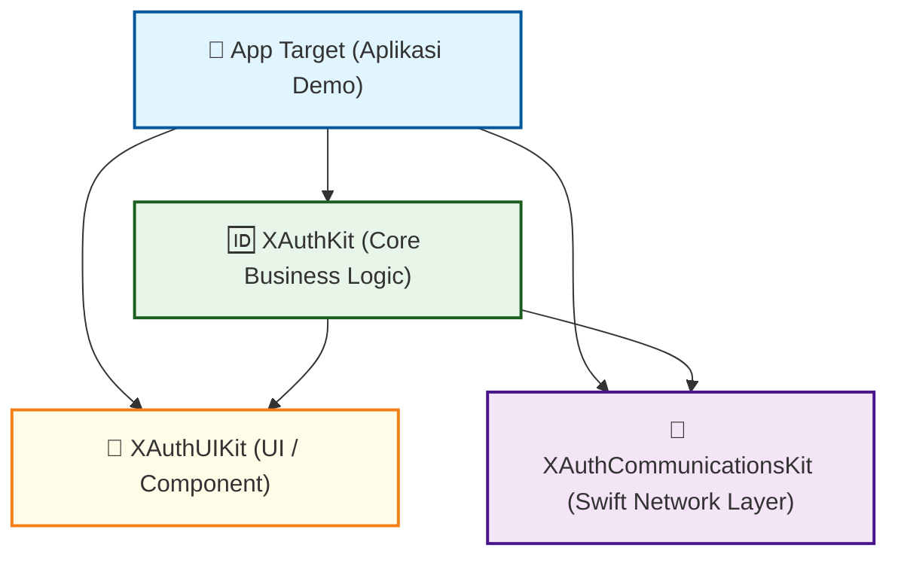
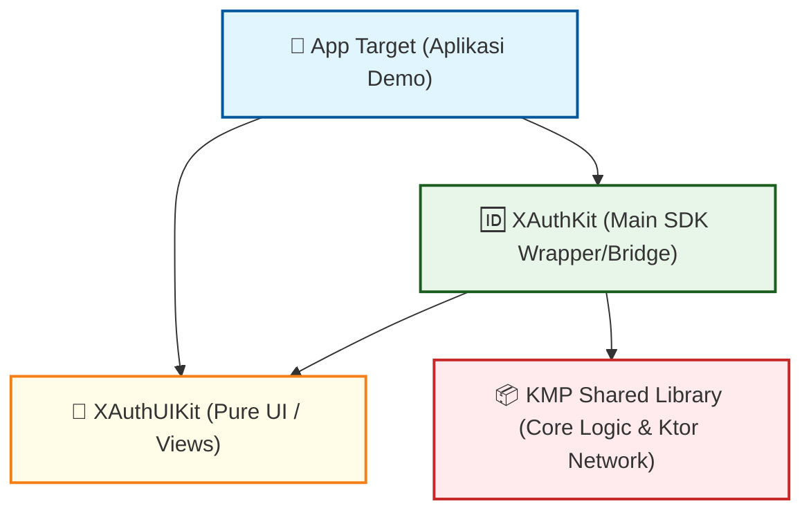
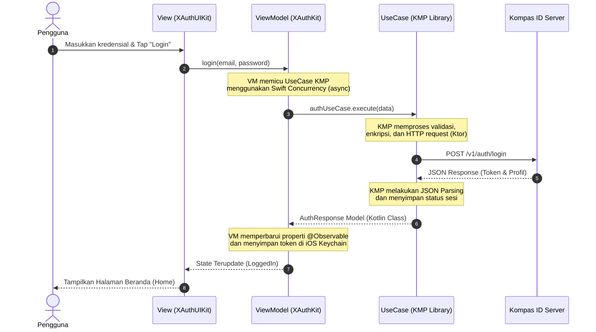

# 📦 Panduan Integrasi KMP (Kotlin Multiplatform) - XAuth iOS SDK

Dokumen ini menjelaskan rancangan arsitektur terbaik (*best practice*) dalam mengintegrasikan **KMP Shared Library** (`NetDataLibrary` / `KompasIdLibrary`) ke dalam proyek modular **XAuth iOS SDK**. 

Panduan ini bertujuan untuk mencegah terjadinya *over-engineering*, duplikasi kode, dan memastikan performa optimal pada ekosistem iOS.

---

## 📐 1. Transformasi Arsitektur Modular

Ketika KMP Shared Library digunakan, sebagian besar logika bisnis (*Domain*) dan pemanggilan API (*Data*) dipindahkan ke KMP. Hal ini berdampak langsung pada peran modul-modul di iOS SDK.

### 🔄 Perbandingan Struktur Modul (Sebelum vs Sesudah KMP)

```carousel
#### Sebelum Integrasi KMP (Arsitektur Swift Tradisional)

* **Keterangan:** Modul `XAuthCommunicationsKit` wajib dibuat untuk menulis HTTP Request, serialisasi JSON, dan endpoint di sisi Swift.
<!-- slide -->
#### Sesudah Integrasi KMP (Rekomendasi Arsitektur Ideal)

* **Keterangan:** Modul `XAuthCommunicationsKit` **dieliminasi (dihapus)** karena seluruh penanganan API dan model data sudah tertanam secara *native* di dalam KMP Shared Library.
````

---

## 📁 2. Pembagian Tanggung Jawab Modul Baru

Dengan diterapkannya arsitektur KMP, tanggung jawab masing-masing modul menjadi sangat ringkas:

| Nama Modul | Tanggung Jawab Utama | Aturan Khusus |
| :--- | :--- | :--- |
| **`XAuthUIKit`** | Komponen visual antarmuka (Views, Custom Buttons, Assets). | **Pure UI:** Tidak boleh mengimpor library KMP atau melakukan logika penyimpanan token. Hanya menerima data siap tampil. |
| **`KMP Shared Library`** | Logika bisnis inti (Use Cases, Validasi), API Calls (Ktor), Repositori, dan *caching*. | **Platform Agnostic:** Ditulis di Kotlin dan dikompilasi menjadi Framework iOS. |
| **`XAuthKit`** | Gerbang utama (Gateway) iOS SDK, jembatan data KMP, dan integrasi fitur spesifik iOS (Keychain, Push Notification). | **Orchestrator:** Mengimpor KMP, memetakan Use Case KMP ke Dependency Injection Swift, dan mengkoordinasikan navigasi. |
| **`App`** | Aplikasi demo utama untuk melakukan pengujian integrasi visual SDK secara lokal. | **Thin Client:** Tidak boleh ada logika bisnis login di sini. |

> [!IMPORTANT]
> **Mengapa mengeliminasi `XAuthCommunicationsKit`?**
> Jika Anda mempertahankan `XAuthCommunicationsKit` hanya untuk membungkus KMP, Anda akan membuat *multiple-layer wrappers* (VM -> `XAuthKit` -> `XAuthCommunicationsKit` -> KMP). Ini merupakan **anti-pattern** (over-engineering) yang memperumit struktur, meningkatkan beban memori, dan memperlambat kompilasi Swift.

---

## 🔄 3. Alur Data & Eksekusi (Sequence Diagram)

Berikut adalah diagram alur bagaimana interaksi pengguna diproses dari visual UI hingga ke server menggunakan kombinasi Swift UI dan KMP:



---

## 🛠️ 4. Pola Implementasi Kode di iOS (Best Practice)

Untuk menerapkan integrasi ini secara rapi, ikuti tiga pilar implementasi berikut:

### 💉 1. Dependency Injection Bridging (Koin ➡️ Factory)
KMP biasanya menggunakan **Koin** untuk DI internal Kotlin. Agar modul iOS tetap rapi, buatlah sebuah adaptor di `XAuthKit` untuk menyalurkan Use Case KMP ke dalam **Factory DI** milik iOS.

```swift
// Di dalam XAuthKit (atau extension Container)
import FactoryKit
import KompasIdLibrary

extension Container {
    /// Menjembatani KMP Koin DI dengan iOS Factory DI.
    /// Memudahkan ViewModel untuk mengambil UseCase tanpa perlu berurusan dengan inisialisasi Kotlin.
    public var authUseCase: Factory<IAuthUseCase> {
        self { KoinInjector().authUseCase }
    }
}
```

### 🌉 2. Thin ViewModel (Jembatan Tipis)
ViewModel di iOS harus sangat tipis (*Thin UI*). ViewModel tidak boleh melakukan kalkulasi logika, melainkan hanya memicu eksekusi Use Case KMP dan memetakan hasilnya ke UI.

```swift
import Foundation
import FactoryKit
import KompasIdLibrary
import XAuthKit

@MainActor
@Observable // SwiftUI Modern Observation
public final class LoginViewModel {
    
    // Properti State untuk UI
    public var isLoading = false
    public var errorMessage: String?
    
    // Menggunakan existential type 'any' untuk mempermudah unit testing (Loose Coupling)
    private let authUseCase: any IAuthUseCase
    
    public init(authUseCase: any IAuthUseCase = Container.shared.authUseCase()) {
        self.authUseCase = authUseCase
    }
    
    public func performLogin(email: String, password: String) async {
        isLoading = true
        errorMessage = nil
        
        let loginData = LoginRequestModel(email: email, password: password)
        
        do {
            // Memanggil langsung Use Case KMP secara asinkron (Swift Concurrency)
            let result = try await authUseCase.execute(data: loginData)
            
            // Simpan status sukses atau token tambahan spesifik iOS jika ada
            print("Login Sukses: \(result.accessToken)")
        } catch {
            self.errorMessage = error.localizedDescription
        }
        
        isLoading = false
    }
}
```

### 🔒 3. Swift 6 & Strict Concurrency
Kotlin Multiplatform mendukung eksekusi multi-threading secara internal. Namun, saat memanggil fungsi KMP dari Swift:
* Gunakan dekorator `@MainActor` pada ViewModel untuk menjamin pembaruan UI selalu berjalan di *Main Thread*.
* Fungsi `suspend` Kotlin otomatis dibaca sebagai fungsi `async throws` di Swift. Pastikan pemanggilan dibungkus dalam blok `try await`.

---

## 🎯 5. Keuntungan Pendekatan Ini

1. **Satu Sumber Kebenaran (Single Source of Truth):** Aturan bisnis, validasi email/password, konfigurasi API, dan format data hanya ditulis sekali di KMP. Mengurangi risiko inkonsistensi antara iOS dan Android.
2. **Peningkatan Performa Kompilasi (Build Time):** Dengan dihapusnya `XAuthCommunicationsKit`, compiler Xcode memiliki lebih sedikit file Swift untuk dianalisis dan dibangun.
3. **Pemberdayaan Platform Native:** iOS tetap memegang kendali penuh atas *rendering* UI (SwiftUI) dan integrasi OS (Keychain, FaceID, dll.), memastikan aplikasi terasa premium dan responsif.
