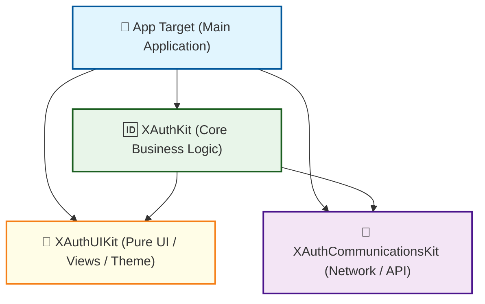
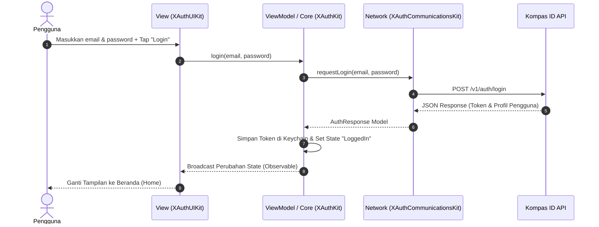

# 🆔 Panduan Arsitektur Modular - XAuth iOS SDK

Dokumen ini menjelaskan struktur modularitas proyek **Kompas ID Auth Kit (XAuth)** di iOS, peran masing-masing folder modul, alur ketergantungan (*dependency flow*), serta sekuens pengolahan datanya.

---

## 📐 1. Diagram Ketergantungan Modul (Dependency Flow)

Berikut adalah diagram ketergantungan antar modul di dalam proyek **XAuth**:



> [!NOTE]
> * **Decoupled Architecture:** `XAuthUIKit` (UI) dan `XAuthCommunicationsKit` (Network) dirancang independen/berdiri sendiri (*standalone*). Mereka tidak memiliki dependensi satu sama lain untuk menghindari *circular dependencies* (ketergantungan melingkar).
> * **Orchestrator:** `XAuthKit` bertindak sebagai integrator yang mempertemukan logika bisnis, visual UI, dan panggilan jaringan.

---

## 📁 2. Detail Tanggung Jawab Modul

### 📡 1. `XAuthCommunicationsKit`
* **Tanggung Jawab:** Logika komunikasi data / API request.
* **Isi Folder:** 
  * HTTP client wrapper.
  * Definisi endpoint API Kompas ID.
  * Model penampung response data (Decodable structs).
* **Aturan Penggunaan:** Modul ini murni logikal data. Dilarang mengimpor library UI (seperti `UIKit` atau `SwiftUI`) ke dalam modul ini.

### 🎨 2. `XAuthUIKit`
* **Tanggung Jawab:** Komponen visual antarmuka pengguna (Views, Assets).
* **Isi Folder:**
  * Reusable UI components (tombol kustom, text fields, dll).
  * SwiftUI Views / UIKit View Controllers untuk layar login & register.
  * Aset katalog warna, gambar, logo, dan font.
* **Aturan Penggunaan:** Hanya fokus pada rendering state UI. Dilarang menulis logika bisnis (seperti penyimpanan session token atau autentikasi) di dalam modul ini.

### 🆔 3. `XAuthKit`
* **Tanggung Jawab:** Logika bisnis utama, manajemen status (*state management*), dan penyimpanan session.
* **Isi Folder:**
  * ViewModels dan Coordinators.
  * Manajer otentikasi (AuthManager).
  * Penyimpanan aman token (Keychain wrapper).
* **Aturan Penggunaan:** Modul ini menggabungkan model data dari `XAuthCommunicationsKit` dengan antarmuka dari `XAuthUIKit`.

### 📱 4. Aplikasi Utama (`App`)
* **Tanggung Jawab:** Target eksekutabel / aplikasi demo utama yang menggabungkan seluruh kit untuk presentasi visual.
* **Isi Folder Pendukung:**
  * **`App/Sources/App/`**: Konfigurasi global lifecycle dan inisialisasi framework luar.
    * **[Bundle+App.swift](file:///Users/kompasdigital/Documents/work/kompas-id-auth-kit-ios/App/Sources/App/Bundle+App.swift)**: Convenience helper extension untuk akses bundle utama.
    * **[FirebaseConfiguration.swift](file:///Users/kompasdigital/Documents/work/kompas-id-auth-kit-ios/App/Sources/App/FirebaseConfiguration.swift)**: Logika pemuatan berkas `GoogleService-Info.plist` secara dinamis dari bundle berdasarkan variabel build `GOOGLE_SERVICE_INFO_PLIST_NAME` (sangat berguna untuk pemisahan lingkungan Staging & Prod).
  * **`App/Sources/Generated/`**: Sumber daya terjemahan kode otomatis oleh tools eksternal.
    * **[AppAssets+Generated.swift](file:///Users/kompasdigital/Documents/work/kompas-id-auth-kit-ios/App/Sources/Generated/AppAssets+Generated.swift)**: Enum katalog aset visual type-safe (`AppAssets`) yang dikelola otomatis oleh **SwiftGen** untuk meminimalkan *hardcoded string literals* di aplikasi.

---

## 🔄 3. Alur Proses Otentikasi (Sequence Diagram)

Berikut adalah contoh alur proses ketika pengguna melakukan *Login* di aplikasi:



---

## 🛠️ 4. Panduan Pemeliharaan untuk Developer

Bagi developer yang mengubah struktur folder atau menambahkan file:
1. Jangan langsung mengubah berkas `.xcodeproj` secara manual.
2. Definisikan file baru di folder fisik bersangkutan, lalu jalankan perintah otomatisasi:
   ```bash
   make update
   ```
3. Pastikan kode baru mematuhi batasan akses kontrol. Gunakan `internal` atau `private` secara default, dan ekspos API keluar dengan `public` hanya di modul `XAuthKit` sebagai pintu gerbang utama SDK.
